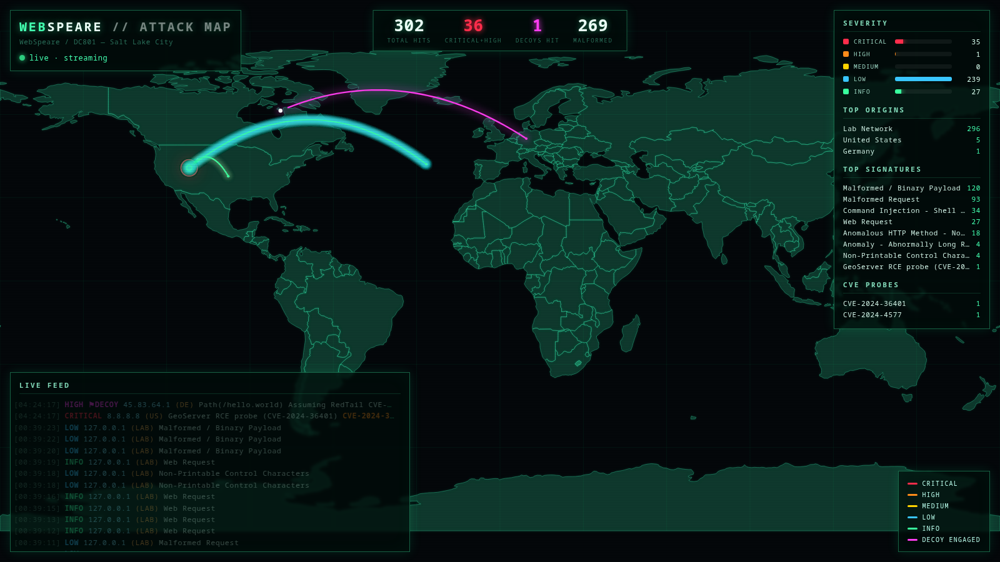

# WebSpeare

**A deceptive web honeypot, canary, and tarpit — written in pure Ruby, with no dependencies.**

WebSpeare serves a quiet little page of Shakespeare to anyone who visits. Real humans see poetry. Crawlers and scanners see something else entirely: a maze of bait links, fake login panels, and planted "trigger strings" that look exactly like the errors and endpoints automated tools are built to hunt for. When they take the bait, WebSpeare logs everything — and, for a growing set of known exploits, *plays along* so the attacker burns their real payload on a target that was never real.

> The name is the whole idea: **Shakespeare → WebSpeare.** Human text as camouflage.

It started as three things stacked together:

1. **Human text** — real Shakespeare, rendered as a believable page so the site reads as genuine to a person.
2. **A crawler trap** — bait paths and (by design) invisible hyperlinks woven into that text, leading nowhere a human would ever click.
3. **Trigger strings** — fake errors and tells that automated scanners are specifically written to look for, to lure them deeper.

Everything else — the WAF engine, the interactive CVE decoys, the tarpit, the Graylog pipeline — was built *on top* of that core.

Three goals drive every feature:

- **Deceive** — make the host look real, vulnerable, and worth attacking.
- **Classify** — figure out *what* is knocking and *what it's after*, and tag it.
- **Slow down** — waste the attacker's time and resources for as long as possible.

> Think of it as a **mini-GreyNoise you can run yourself — but higher-interaction.** GreyNoise classifies internet noise by serving a fake login page and watching. WebSpeare goes further: it answers exploit probes convincingly, hands back fake credentials and command output, and tarpits the connection — so you capture the *follow-up* behavior, not just the first knock.

---

## Why it exists

WebSpeare is a **research tool, and it's meant to be adapted.** I run it across multiple servers and report findings back to Graylog for [DC801](https://dc801.org) as ongoing, semi-private research into what's actually crawling the internet right now.

It is deliberately small, readable, and dependency-free so that you can fork it, drop in your own bait, write your own decoys, and point it at your own logging stack without fighting a framework. If you want to study scanner behavior — or just waste an attacker's time — this is a starting point you can actually read end to end.

---

## Highlights

- **Pure Ruby, zero dependencies.** The core runs on the standard library alone (`socket`, `openssl`, `json`, `uri`…). Easy to audit, easy to deploy anywhere Ruby runs.
- **Active deception, not passive logging.** Tarpit delays and interactive decoys waste attacker time and capture the *follow-up* payloads most honeypots never see.
- **A pluggable, priority-based WAF engine.** Mix fast declarative JSON regex rules with full-code interactive decoys. Register anything by priority; first match wins.
- **Built from real-world traffic.** The rule sets under `waf/legacyrules/` are distilled from live attacks observed across multiple deployments.
- **Production-minded.** Per-rule fault isolation, regexes precompiled once at load (~7ms/request), reverse-proxy aware, and automatic public-IP redaction across every log path.
- **SIEM-ready observability.** Structured JSON logs and Graylog/GELF export, so every classified hit lands in your stack.

---

## How it works

Every request flows through the same short lifecycle:

```
TCP accept ─▶ parse (hand-rolled HTTP) ─▶ firewall (priority-ordered rules)
                                              │
                          triggered? ─── yes ─┤─▶ decoy responds / drop      ─▶ log
                                              │
                                       no ────┴─▶ serve the Shakespeare page ─▶ log
```

- **The server** (`src/back.rb`, `HoneySet`) is a small multi-threaded TCP server with an event API (`on(:request)`, `on(:error)`, `on(:close)`). It parses raw HTTP by hand, normalizes headers, salvages malformed/binary payloads as base64 instead of dropping them, and is aware of an upstream reverse proxy (resolving the real client IP while stripping the plumbing header from logs).
- **The firewall** (`src/firewall.rb`) runs registered rules in priority order and returns on the first match. Each rule executes inside its own rescue, so one bad rule can never take down the request handler.
- **The page** (`config/site.html`) is the bait: a plausible "ShakeSpeare Poems" site with member / admin / employee login panels and a search box — all the things a scanner wants to find.

---

## The rule engine: two kinds of rules

WebSpeare deliberately supports two paradigms so you can reach for the right tool:

### 1. Declarative JSON rules (`waf/legacyrules/*.json`)

For everything that's "match a pattern, flag it." No code required:

```json
{
  "name": "GeoServer RCE probe (CVE-2024-36401)",
  "level": "critical",
  "section": ["url", "headers", "body"],
  "regex": "geoserver.*ResourceURL",
  "action": "drop"
}
```

Regexes are compiled once at load, invalid patterns are dropped with a warning (never reaching the hot path), and rules are sorted by severity so a generic fingerprint can't shadow a critical exploit match.

### 2. Interactive decoys (`waf/decoys/*.rb`)

For when you want to *respond* convincingly. A decoy is a small Ruby class that inspects the request and returns a crafted reply. Current decoys include:

| Decoy | Target | What it does |
|-------|--------|--------------|
| `phpunit-rce` | CVE-2017-9841 (PHPUnit `eval-stdin.php`) | Computes the **real** `md5()` the probe asked for, so the scanner believes it has code execution |
| `CVE-2025-55182` | React2Shell RCE | Fakes root command output, serves forged AWS credentials, handles the multi-stage metadata-theft flow |
| `redtail-hello-world` | CVE-2024-4577 (PHP-CGI) | Spoofs the RedTail "hello world" confirmation probe |
| `PHPInfoDecoy` | `phpinfo()` discovery | Returns a convincing fake `phpinfo` surface |
| `cPanel` | cPanel login discovery | Spoofs a cPanel endpoint |
| `upload-traversal` | Upload / path-traversal probes | Plays along with malicious-upload decoys |

The idea is always the same: convince the attacker the host is vulnerable so their **real** follow-up payload lands in your logs instead of on a victim.

### Writing your own rule

Every rule — JSON or decoy — answers with the same contract:

```ruby
{
  triggered: true,    # did this rule match?
  overwrite: true,    # are we sending our own response?
  reason:    "Decoy-PHPUnit RCE (CVE-2017-9841)",  # shows up in logs
  payload:   reply,   # the raw HTTP response to write (when overwrite)
  code:      200,     # status, for logging
}
```

Register it in `main.rb` with a priority (lower runs first):

```ruby
firewall.register(myDecoy.method(:runCheck), 110)
```

---

## Observability

- **Text + JSON logs** (`logs/` and `logs/json/`), rotated per day. Each hit records method, path, params, headers, body size, source, and — when a rule fired — the rule that classified it.
- **Graylog / GELF export** — flip `graylog.enabled` in the config and every request is shipped to your SIEM. This is how the DC801 research feed is collected.
- **Public-IP redaction** is on by default and applied across raw headers, values, and log lines, so captures are safe to share.

---

## The attack map

A live, self-contained GeoIP attack map lives under `attack-map/`. It tails the
same structured JSON logs WebSpeare already writes, geolocates each source, and
renders a WarGames-style globe of incoming probes — color-coded by severity,
with interactive-decoy engagements called out in their own color.



**Built for the lab.** It pulls **zero external resources at runtime** — no tile
servers, CDNs, or web fonts. The world is an embedded vector map drawn on a
single `<canvas>`, so it runs fine on an air-gapped network.

- **Transport:** Server-Sent Events (`/api/stream`) broadcast every classified
  hit to all connected viewers in real time, backed by a server-side ring buffer
  so a freshly opened map immediately shows recent history (`/api/recent`) and
  live aggregate stats (`/api/stats`). It degrades to polling if SSE is
  unavailable.
- **Classification:** every log shape WebSpeare has ever emitted is handled —
  `wafRule` as a plain string *or* a full rule object, timestamps as epoch /
  ISO-8601 / `"YYYY-MM-DD HH:MM:SS ±ZZZZ"`. Each hit is tagged with a severity,
  any referenced CVE, whether an interactive **decoy** was engaged, and whether
  the payload was malformed/binary.
- **Lab mode:** loopback and RFC-1918 sources (your own fuzzing and testing)
  are scattered to stable synthetic coordinates so they still plot, instead of
  being silently dropped. Toggle with `labMode` in `attack-map/config.json`.

### Running it

```bash
cd attack-map
bundle install                 # maxmind-geoip2 (+ base64 on Ruby ≥ 3.4)
ruby build_world.rb world.geojson   # one-time: regenerate web/world.json (already committed)
ruby main.rb                   # serves the map on 127.0.0.1:8082
```

You'll need MaxMind's free `GeoLite2-City.mmdb` in the `attack-map/` directory.
Point a browser at `http://127.0.0.1:8082`. Append `?shot` for a static,
no-stream snapshot (handy for screenshots and headless capture).

Config (`attack-map/config.json`) covers the bind host/port, the log directory
it tails, the honeypot's own map coordinates (`honeypot`), `labMode`, the
`ringBuffer` size, how many historical events to `backfill` on start, and the
`statsIntervalSeconds` heartbeat.

---

## Quick start

### Docker

```bash
docker build -t webspeare .
docker run -p 8081:8081 -v "$PWD/logs:/app/logs" webspeare
```

### Bare Ruby (no dependencies)

```bash
ruby main.rb
```

Then point a browser at `http://127.0.0.1:8081` to see the bait page, or throw a scanner at it and watch the logs.

> WebSpeare is designed to sit **behind a reverse proxy** (e.g. nginx) that passes the real client IP via a `WebSpeare-Nginx-Real-IP` header. It terminates plain HTTP itself; let the proxy handle TLS.

---

## Configuration

Everything lives in `config/config.json`:

| Key | Purpose |
|-----|---------|
| `server` | Host / port to bind |
| `web` | Paths to the poem corpus, bait list, and page template |
| `logs` | Log directories and time/file formats |
| `graylog` | Enable + target for GELF export |
| `security-txt` | Serves a `/.well-known/security.txt` |
| `backend-spoof` | The **tarpit**: random response delay (min/max seconds) to waste attacker time |
| `redactPublicIP` | What to scrub from logs, and what to replace it with |

---

## Roadmap & honest limitations

This is a research tool, run by one person across a handful of servers. Things to know before you lean on it:

- **The crawler-trap link weaving is currently scaffolded but disabled** (`main.rb`, `ServerUtils#randomWrap`). Right now it serves clean poem text; the invisible-hyperlink injection is commented out and on the list to bring back.
- **No automated test suite yet.** There are fuzzers under `fuzz/`, but the hand-rolled HTTP parser — the real attack surface — has no unit tests around it.
- **The Dockerfile pins an old Ruby.** Bumping off the EOL base image is a planned, easy win.
- This is **not** a drop-in WAF for production traffic. It's a deception and research tool. Run it on infrastructure you're willing to expose to attackers, behind a proxy, with the logs going somewhere you trust.

---

## License & contact

Research project maintained by Oak Atsume for [DC801](https://dc801.org).

- Contact: `oak@801labs.org`
- Discord: `@OakAtsume`

Fork it, adapt it, point it at your own logging stack — that's what it's for.
